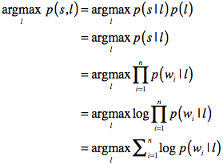

## Language Detection Model
#### Training and testing of a language detection model for the European Parliament Proceedings Parallel Corpus 1996-2011.
#### The project contains two python class files and an iPython notebook file.

See the iPython notebook *LanguageDetectionModel.ipynb* for an example of use.

#### *Algorithm* 
Language detection on a sentence from an unknown language is done by finding the language that maximizes the joint probability of the language and the sentence. The joint probability is computed as the conditional probability of the sentence given the language multiplied by the probability of the language. The probability of each language is assumed to be the same so this term is dropped in the maximization. The probability of a sentence given a language is simplified by assuming that the words of the sentence are independent (unigram model). The sentence probability then becomes the product of each word's probability given the language.

The training algorithm computes the language dependent word probabilities (unigram). It first counts the number of occurrences of each word in the language. After all the counts are complete the counts are divided by the total number of word occurrences in each language to get probabilities.

Log probabilities are summed rather than probabilities multiplied to prevent underflow. 

The solution to the maximization is shown in the equations below.

Word probabilities are computed by a ratio of the number of occurances of a word in the language and the total number of words in the language.

#### *Results*
Test results: two errors in 21,000 test sentences for an error rate less than 0.01%

#### *Computation Time*
The *LanguageDetectionModel.ipynb* notebook runs in less that 12 minutes on a Macbook Pro (Late 2013)

#### *Development*
Software development was done in python 3.5.1